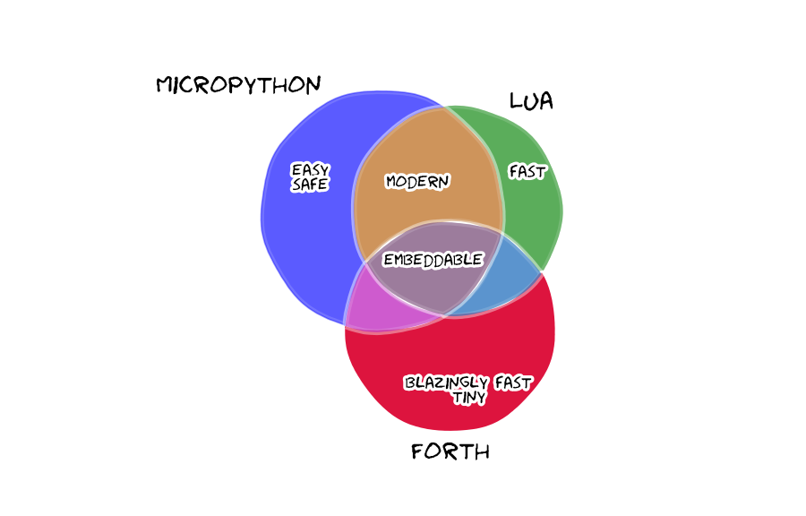

# 
Shi is a fast and tiny **embeddable** [Forth](https://en.wikipedia.org/wiki/Forth_(programming_language)) implementation written for the [Thumb-2 ISA](https://infocenter.arm.com/help/topic/com.arm.doc.qrc0001m/QRC0001_UAL.pdf) (ARMv7-M and newer). It currently fits into less than **7kB** of flash and **320B** of ram. Some of it's features are
* Single header interface to C/C++
* Compilation to flash
* Optimizations such as inlining and constant folding

# Quick'n'dirty

### C++
```c++
#define FLASH_END 0x080FFFFFUL
alignas(4) std::array<uint8_t, 16 * 1024> data{};

void quick_n_dirty() {
  using namespace shi::literals;

  shi::init({.data_begin = (uint32_t)(begin(data)),
             .data_end = (uint32_t)(end(data)),
             .text_begin = FLASH_END - 32 * 1024,
             .text_end = FLASH_END});
             
  // Running code
  shi::evaluate("13 29 +");
  printf("size:%d top:%d\n", shi::size(), shi::top());

  // Same but using literal _s
  "1 -"_s;
  printf("size:%d top:%d\n", shi::size(), shi::top());

  // Creating a new definition called "mean" and then call it through Word
  ": mean + 2 / ;"_s;
  shi::Word mean{"mean"};
  int32_t retval{mean(100, 200)};
  printf("mean(100, 200) = %d\n", retval);

  // Same but using literal _w
  retval = "mean"_w(100, 50);
  printf("mean(100, 50) = %d\n", retval);

  // Getting multiple return values by using std::tuple
  ": range 0 do i loop ;"_s;
  std::tuple<int32_t, int32_t, int32_t, int32_t> t{"range"_w(4)};
  printf("range: %d %d %d %d\n",
         std::get<0>(t),
         std::get<1>(t),
         std::get<2>(t),
         std::get<3>(t));

  // Pushing values onto the stack
  int64_t big{6'812'712'319'812'946'239};
  shi::push(111, big, 222);
  printf("size:%d top:%d\n", shi::size(), shi::top());

  // Getting values from the stack without popping can be done using top
  // top takes a "cell-sized" offset to refer to elements further down the stack
  int64_t big_top{shi::top<int64_t>(1)};
  printf("big equal big_top ? %s\n", big == big_top ? "yes" : "no");

  // Popping values
  int32_t small_pop{shi::pop()};
  printf("size:%d\n", shi::size());
  int64_t big_pop{shi::pop<int64_t>()};
  printf("size:%d\n", shi::size());

  // Clear the stack
  shi::clear();
  printf("size:%d top:%c\n", shi::size(), shi::top());

  // Pushing user-defined types onto the stack
  struct S {
    char c[3];
    int32_t i;
  };
  S s{{'x', 'y', 'z'}, 1000};
  shi::push(s, 111, 222, 333);

  // User-defined types on the stack can be accessed by reference
  S& s_top{shi::top<S>(3)};
  printf("s_top c[0]:%c c[1]:%c c[2]:%c i:%d\n",
         s_top.c[0],
         s_top.c[1],
         s_top.c[2],
         s_top.i);

  // Creating a definition which refers to a C variable
  int32_t moore_birthday{1938};
  shi::variable(&moore_birthday, "moore_bday");
  "2019 moore_bday @ -"_s;
  printf("Charels H. Moore was born %d years ago\n", shi::top());

  // Same but using literal _v
  uint8_t moore_age;
  "moore_age"_v(&moore_age);
  "moore_age c!"_s;
  printf("Moore's age equal 81 ? %s\n", moore_age == 81 ? "yes" : "no");
};
```

### C
```c
#define FLASH_END 0x080FFFFFUL
uint8_t data[16 * 1024] __attribute__((aligned(4)));

void c_quick_n_dirty() {
  Shi_init i = {.data_begin = (uint32_t)(&data[0]),
                .data_end = (uint32_t)(&data[16 * 1024]),
                .text_begin = FLASH_END - 32 * 1024,
                .text_end = FLASH_END};
  shi_init(i);

  // Running code
  shi_evaluate("13 29 +");
  printf("size:%d top:%d\n", shi_size(), shi_top_number(0));

  // Creating a new definition called "mean" and then call it through Word
  shi_evaluate(": mean + 2 / ;");
  Word mean = shi_tick("mean");
  shi_push_number(100);
  shi_push_number(200);
  shi_word(mean);
  int32_t retval = shi_pop_number();
  printf("mean(100, 200) = %d\n", retval);

  // Pushing values onto the stack
  int64_t big = 6812712319812946239;
  shi_push_number(111);
  shi_push_double(big);
  shi_push_number(222);
  printf("size:%d top:%d\n", shi_size(), shi_top_number(0));

  // Getting values from the stack without popping can be done using top
  // top takes a "cell-sized" offset to refer to elements further down the stack
  int64_t big_top = shi_top_double(1);
  printf("big equal big_top ? %s\n", big == big_top ? "yes" : "no");

  // Popping values
  int32_t small_pop = shi_pop_number();
  printf("size:%d\n", shi_size());
  int64_t big_pop = shi_pop_double();
  printf("size:%d\n", shi_size());

  // Clear the stack
  shi_clear();
  printf("size:%d top:%c\n", shi_size(), shi_top_number(0));

  // Pushing user-defined types onto the stack
  typedef struct {
    char c[3];
    int32_t i;
  } S;
  S s = {{'x', 'y', 'z'}, 1000};
  shi_push_struct(&s, sizeof(s));
  shi_push_number(111);
  shi_push_number(222);
  shi_push_number(333);

  // User-defined types on the stack can be accessed by pointer
  S* s_top;
  shi_top_struct(&s_top, 3);
  printf("s_top c[0]:%c c[1]:%c c[2]:%c i:%d\n",
         s_top->c[0],
         s_top->c[1],
         s_top->c[2],
         s_top->i);

  // Creating a definition which refers to a C variable
  int32_t moore_birthday = 1938;
  shi_variable(&moore_birthday, "moore_bday");
  shi_evaluate("2019 moore_bday @ -");
  printf("Charels H. Moore was born %d years ago\n", shi_top_number(0));
}
```

# Forth...
Forth is an imperative explicitly stack-based language mostly known for its quirky [RPN](https://en.wikipedia.org/wiki/Reverse_Polish_notation) syntax. Explicitly stack-based means that everything either consumes or creates elements on a gobal data-stack upon execution. While other languages differ between expressions, operators, functions and so on Forth only has the notion of *words*. A word can be any combination of characters but a whitespace and simply denotes an executable entry in a collection of words called a *dictionary*. A word not found by the parser must be a number or results in an *undefined word* error. The dictionary is extensible and allows for the addition of new words.

For further information or a comprehensive tutorial refer to
* [Starting Forth](https://www.forth.com/starting-forth/)
* [Thinking Forth](http://thinking-forth.sourceforge.net/) 

# ...as embedded language
Although extensibility gives Forth a slightly functional touch it's otherwise procedural. There is no type system, no scope, no encapsulation nor any other achievement computer science made over the past four decades. This is why I'm not overly enthusiastic that most implementations out there act as system with a [REPL](https://en.wikipedia.org/wiki/Read%E2%80%93eval%E2%80%93print_loop). The standard way of doing so is implementing the words [key](http://forth-standard.org/standard/core/KEY) and [emit](http://forth-standard.org/standard/core/EMIT) to constantly read and write from a serial interface. Two of the best known Forth's for ARM, [CoreForth](https://github.com/ekoeppen/CoreForth) and [Mecrisp-Stellaris](http://mecrisp.sourceforge.net/>Mecrisp-Stellaris), are following this path. Specially the latter is an amazing piece of software and really stands out with tons of features and a relatively big [ecosystem](https://github.com/jeelabs/embello/tree/master/explore/1608-forth). But so does [MicroPython](http://micropython.org/) and it also comes with a type system, functions, classes, scope, encapsulation, a comprehensive standard library and pretty much everything else you'd expect from a modern language.

Compared to the most popular choices [MicroPython](http://micropython.org/) and [Lua](https://www.lua.org/) there isn't much Forth has to offer...



besides exceptional performance and an absurdly tiny footprint.

## Benchmarks
Let's backup my claims with some actual benchmarks. There are (currently) three test cases to be found in [/src/test/bench](/src/test/bench).
1. Naive [ackermann function](https://en.wikipedia.org/wiki/Ackermann_function)
2. Counting primes by trial division till 100.000
3. 2D [lerp](https://en.wikipedia.org/wiki/Linear_interpolation) of a random set of 2000 integers inside a C for-loop

All cases are compared to a native C implementation compiled with -Os and [noinline](https://gcc.gnu.org/onlinedocs/gcc-3.1/gcc/Function-Attributes.html) function annotations.


And here are the raw values in µs.

| Language    | Ackermann | Counting primes | 2D lerp |
| ----------- | --------- | --------------- | ------- |
| C           | 43        | 131935          | 619     |
| Lua         | 3087      | 8279811         | 19961   |
| MicroPython | 6851      | 8302808         | 136294  |
| Forth (Shi) | 172       | 828119          | 3108    |

## Reverse Polish  (what makes it small and fast)
Although Forth is quite a unique language in all of its aspects it is the complementary RPN and stack which really let it shine in very restricted environments. To understand why let's create a real world example by writing a linear interpolation function we'd like to parse and interpret or even compile.

In common infix notation languages like C we'd probably write something like
```c
int lerp(int x, int x1, int x2, int y1, int y2) {
  return y1 + ((y2 - y1) * (x - x1)) / (x2 - x1);
}
```

From a programmers point of view this expression is easy to read and understand but it actually puts a lot of responsibility into the hands of the interpreter/compiler. The intended order of operations given by parentheses and precedence rules has to be discovered. In case the language ain't stack-based there might be a calling convention the interpreter/compiler needs to obey. It needs to figure out which registers are used for passing and returning arguments. Typically an expression has to be parsed multiple times in order to build up whats called an [AST](https://en.wikipedia.org/wiki/Abstract_syntax_tree), a representation of the input the compiler can work with. This is a time and memory consuming task.

In Forth the same function could be written as
```
: lerp ( x x1 x2 y1 y2 -- y )
  over - 4 roll 4 pick - * 2swap swap - / +
;
```

This is inarguably harder to read and shifts responsibility from the interpreter/compiler to the programmer but it has one major advantage. It allows for handling everything in a single pass. Every single *word* from the input stream can be interpreted or compiled without any prior or subsequent knowledge. New *words* such as *lerp* simply use calls (or inlined copies of the assembly) to other fine grained *words* such as *over* or *-* to achieve a very high level of reusability. A Forth parser basically degenerates to a linked list look-up which easily fits into a few kB of memory.

If you don't immediately understand the *words* between the actual operators don't worry. These are sometimes refered to as "stack jugglers" and simply put stack arguments in the right order. The right order can be found by converting the original algorithm from infix to postfix notation using the [shunting-yard algorithm](https://en.wikipedia.org/wiki/Shunting-yard_algorithm).

```c
// Infix notation
y1 + ((y2 - y1) * (x - x1)) / (x2 - x1)

// Reverse Polish notation (postfix notation)
y1 y2 y1 - x x1 - * x2 x1 - / +
```